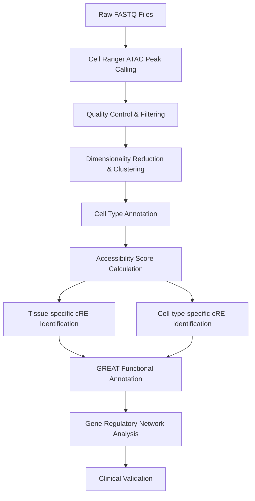

# Cell- and Tissue-specific Cis-Regulatory Elements (cRE) Pipeline

[](https://doi.org/10.XXXX/XXXXXX)
[](https://www.gnu.org/licenses/gpl-3.0)
[](./rwin_full_env.yml)

**A comprehensive computational pipeline for identifying cell-type and tissue-specific cis-regulatory elements from single-cell ATAC-seq data, with applications to disorders of sex development (DSD)**

## 👥 Authors

- **Gulrez Chahal** - gulrez.chahal@mcri.edu.au
- **Svenja Pachernegg** - svenja.pachernegg@mcri.edu.au
- **Ngoc Duy Tran** - ngocduy.tran@mcri.edu.au
- **Fernando Rossello** - fernando.rossello@mcri.edu.au
- **Mirana Ramialison** - mirana.ramialison@mcri.edu.au

*Murdoch Children's Research Institute, Melbourne, Australia*

## 📖 Table of Contents

- [Authors](#-authors)
- [Overview](#-overview)
- [Biological Background](#-biological-background)
- [Repository Structure](#-repository-structure)
- [Installation & Setup](#-installation--setup)
- [Pipeline Workflow](#-pipeline-workflow)
- [Usage Examples](#-usage-examples)
- [Results & Outputs](#-results--outputs)
- [Citation](#-citation)
- [Contact](#-contact)

## 🔬 Overview

### Purpose
This pipeline systematically identifies cell-type and tissue-specific cis-regulatory elements (cREs) from single-cell ATAC-seq (scATAC-seq) data to understand gene regulatory networks involved in human gonadal development and disorders of sex development (DSD).

### Key Features
- **Multi-tissue comparison**: Identifies gonad-specific cREs by comparing against heart, brain, eye, and stomach tissues
- **Cell-type resolution**: Maps cREs to specific cell lineages (Sertoli, Leydig, coelomic epithelium, etc.)
- **Clinical relevance**: Links identified regulatory regions to genes implicated in DSD
- **Reproducible workflow**: Containerized environment with documented computational requirements

### Methodological Approach
The pipeline integrates multiple analytical layers:
1. **Peak calling** from raw scATAC-seq data using Cell Ranger ATAC
2. **Quality control and filtering** using Signac/Seurat framework
3. **Tissue-specificity analysis** through comparative genomics
4. **Cell-type-specific cRE mapping** using accessibility scores
5. **Functional annotation** via GREAT gene ontology analysis

## 🧬 Biological Background

### Introduction and Rationale

Disorders of sex development (DSD) are common congenital conditions affecting approximately 1 in 4,500 births worldwide. The underlying etiology is often genetic, requiring comprehensive understanding of genes involved in gonadal development. Current genome sequencing approaches for DSD diagnosis frequently identify "variants of unknown significance" (VUS), particularly in non-coding regions where regulatory function remains unexplored.

### Scientific Hypothesis

We hypothesize that identification of regulatory regions specific to each testis cell type will facilitate discovery of novel genes essential for **Cell specification** during gonadal development

### Experimental Design

The pipeline utilizes single-cell ATAC-seq data from multiple human developmental timepoints to:

1. **Capture functional regulatory regions** through identification of accessible chromatin
2. **Define tissue specificity** by comparative analysis across organs
3. **Resolve cell-type heterogeneity** within gonadal tissues
4. **Predict regulatory targets** using genomic proximity and expression correlation

### Dataset Description

| Tissue | Developmental Stage (DPC) | Key Cell Types |
|--------|---------------------------|----------------|
| **Testis** | 84 | Coelomic epithelium, Sertoli cells, Leydig cells, Early somatic cells, Supporting gonadal cells, Primordial germ cells |
| **Ovary** | 84 | Coelomic epithelium, Pre-granulosa cells, Supporting cells, Mesenchymal cells, Endothelial cells |
| **Cerebrum** | 89 | Erythrocytes, Vascular endothelial cells, Inhibitory/excitatory neurons, Limbic system neurons |
| **Eye** | 91 | Ganglion cells, Photoreceptor cells, Retinal pigment cells, Retinal progenitors, Muller glia |
| **Heart** | 94 | Cardiomyocytes, Endocardial cells, Epicardial cells, Smooth muscle cells, Lymphoid/myeloid cells |
| **Stomach** | 91 | Vascular endothelial cells, ENS glia, Goblet cells, Parietal/chief cells, Stromal cells |

*DPC = Days Post Conception*

## 📁 Repository Structure

```
Cell-and-Tissue-specific-cRE-pipeline/
├── README.md                           # This comprehensive documentation
├── rwin_full_env.yml                   # Conda environment specification
├── LICENSE                             # GPL v3 license
│
├── data/                               # Input data and metadata
│   ├── meta.csv                        # [Sample metadata with cell annotations](./data/meta.csv)
│   ├── female/                         # Female gonad scATAC-seq data
│   └── male/                           # Male gonad scATAC-seq data
│
├── scripts/                            # Analysis notebooks and utilities
│   ├── Pipeline_Testing.ipynb          # [Main ovary analysis pipeline](./scripts/Pipeline_Testing.ipynb)
│   ├── Pipeline_Testing Testes.ipynb   # [Main testis analysis pipeline](./scripts/Pipeline_Testing%20Testes.ipynb)
│   ├── investigation_ovary.ipynb       # [Cell-type specific analysis - ovary](./scripts/investigation_ovary.ipynb)
│   ├── investigation_testes.ipynb      # [Cell-type specific analysis - testis](./scripts/investigation_testes.ipynb)
│   └── tissue_specific_cre_pipeline/   # Tissue-specificity analysis tools
│       ├── LD_getSubsets.py            # [Core tissue comparison script](./scripts/tissue_specific_cre_pipeline/LD_getSubsets.py)
│       ├── compare_GREAT_genes.pl      # [GREAT analysis comparison](./scripts/tissue_specific_cre_pipeline/compare_GREAT_genes.pl)
│       └── merge_heart_rna_seq.pl      # [RNA-seq integration utilities](./scripts/tissue_specific_cre_pipeline/merge_heart_rna_seq.pl)
│
├── PBS_scripts/                        # High-performance computing scripts
│   └── scATAC_fastq_pipeline_single_sample1.pbs  # [Peak calling job template](./PBS%20scripts/scATAC_fastq_pipeline_single_sample1.pbs)
│
├── results/                            # Analysis outputs
│   ├── celltype-specific/              # Cell-type resolved cREs
│   │   └── row_wise/                   # [Individual cell-type BED files](./results/celltype-specific/row_wise/)
│   │       ├── Endo_row_wise.bed
│   │       ├── Sertoli_row_wise.bed
│   │       ├── ovary_*.bed
│   │       └── ...
│   ├── gender-specific/                # Sex-specific analysis results
│   │   ├── greatExportAll_ovary_p75.tsv    # [GREAT analysis - ovary](./results/gender-specific/greatExportAll_ovary_p75.tsv)
│   │   ├── greatExportAll_testis_p75.tsv   # [GREAT analysis - testis](./results/gender-specific/greatExportAll_testis_p75.tsv)
│   │   ├── p75_female_unique_genes.txt     # [Female-specific genes](./results/gender-specific/p75_female_unique_genes.txt)
│   │   ├── p75_male_unique_genes.txt       # [Male-specific genes](./results/gender-specific/p75_male_unique_genes.txt)
│   │   └── p75_intersection_genes.txt      # [Common genes](./results/gender-specific/p75_intersection_genes.txt)
│   └── tissue-specific/                # Tissue-resolved cREs
│       ├── cerebrum.bed                # [Brain-specific regions](./results/tissue-specific/cerebrum.bed)
│       ├── eye.bed                     # [Eye-specific regions](./results/tissue-specific/eye.bed)
│       ├── heart.bed                   # [Heart-specific regions](./results/tissue-specific/heart.bed)
│       ├── ovary.bed                   # [Ovary-specific regions](./results/tissue-specific/ovary.bed)
│       ├── stomach.bed                 # [Stomach-specific regions](./results/tissue-specific/stomach.bed)
│       └── testes.bed                  # [Testis-specific regions](./results/tissue-specific/testes.bed)
│
├── environment/                        # Computational environment
│   ├── requirements.txt                # Python package dependencies
│   └── sessionInfo.txt                 # R session information
│
└── docs/                              # Additional documentation
    ├── pipeline_flowchart.png          # Visual workflow diagram
    ├── cell_type_annotation_guide.md   # Cell annotation methodology
    └── troubleshooting.md              # Common issues and solutions
```

## ⚙️ Installation & Setup

### Prerequisites

- **Operating System**: Linux/Unix (tested on CentOS 7+)
- **Memory**: Minimum 200GB RAM for peak calling
- **Storage**: ~500GB free space for intermediate files
- **Software Dependencies**: 
  - [Miniconda/Anaconda](https://docs.conda.io/en/latest/miniconda.html)
  - [Cell Ranger ATAC v2.0+](https://support.10xgenomics.com/single-cell-atac)
  - [BEDTools v2.30+](https://bedtools.readthedocs.io/)

### Environment Setup

1. **Clone the repository**
```bash
git clone https://github.com/Ramialison-Lab/Cell-and-Tissue-specific-cRE-pipeline.git
cd Cell-and-Tissue-specific-cRE-pipeline
```

2. **Create conda environment**
```bash
# Create environment from specification file
conda env create -f rwin_full_env.yml

# Activate environment
conda activate /group/tran3/duytran/rwin  # or your local environment name
```

3. **Verify installation**
```bash
# Check Cell Ranger ATAC
cellranger-atac --version

# Check R packages
Rscript -e "library(Signac); library(Seurat); sessionInfo()"

# Check Python packages
python -c "import pandas as pd; import numpy as np; print('Dependencies OK')"
```

### Reference Genome Setup

Download and configure the human reference genome:

```bash
# Download Cell Ranger ATAC reference (GRCh38)
wget https://cf.10xgenomics.com/supp/cell-atac/refdata-cellranger-arc-GRCh38-2024-A.tar.gz
tar -xzf refdata-cellranger-arc-GRCh38-2024-A.tar.gz
```

## 🔄 Pipeline Workflow

### Overview Diagram



### Step-by-Step Protocol

#### Step 1: Raw Data Processing

**Input**: 10X Genomics scATAC-seq FASTQ files
- Format: `{SAMPLE}_S1_L001_{R1,R2,R3,I1}_001.fastq.gz`
- Requirements: 4 files per sample (R1, R2, R3, I1)

**Peak Calling with Cell Ranger ATAC**:

```bash
# Example command for single sample
cellranger-atac count \
    --id=SAMPLE_ID \
    --reference=/path/to/refdata-cellranger-arc-GRCh38-2024-A \
    --fastqs=/path/to/fastq_files \
    --sample=SAMPLE_NAME \
    --localcores=12 \
    --localmem=200
```

**PBS Script Template**: [`PBS_scripts/scATAC_fastq_pipeline_single_sample1.pbs`](./PBS%20scripts/scATAC_fastq_pipeline_single_sample1.pbs)

**Output**: 
- `outs/filtered_peak_bc_matrix.h5` - Filtered peak-cell matrix
- `outs/peaks.bed` - Called peaks in BED format
- `outs/fragments.tsv.gz` - Fragment coordinates

#### Step 2: Quality Control & Analysis

**Signac/Seurat Pipeline**:

For **ovary data**: [`scripts/Pipeline_Testing.ipynb`](./scripts/Pipeline_Testing.ipynb)
For **testis data**: [`scripts/Pipeline_Testing Testes.ipynb`](./scripts/Pipeline_Testing%20Testes.ipynb)

**Key Parameters**:
```r
# Quality control thresholds
min_cells <- 10        # Minimum cells per peak
min_features <- 200    # Minimum peaks per cell
max_features <- 20000  # Maximum peaks per cell (doublet filter)
mito_cutoff <- 20      # Maximum mitochondrial percentage

# Filtering parameters  
quantile_threshold <- 0.75  # Q75 accessibility threshold
```

**Analysis Steps**:
1. **Data loading** and format conversion
2. **Quality metrics** calculation (TSS enrichment, nucleosome signal)
3. **Filtering** low-quality cells and peaks
4. **Normalization** using TF-IDF transformation
5. **Dimensionality reduction** (LSI, UMAP)
6. **Clustering** using Leiden algorithm
7. **Cell type annotation** based on accessibility profiles

#### Step 3: Tissue-Specificity Analysis

**Script**: [`scripts/tissue_specific_cre_pipeline/LD_getSubsets.py`](./scripts/tissue_specific_cre_pipeline/LD_getSubsets.py)

**Usage**:
```bash
python LD_getSubsets.py \
    ovary_filtered.bed \
    testis_filtered.bed \
    heart_regions.bed \
    brain_regions.bed \
    eye_regions.bed \
    stomach_regions.bed \
    ./output_directory/
```

**Algorithm**:
1. **Union peak set** creation across all tissues
2. **Accessibility comparison** using BEDTools intersect
3. **Statistical testing** for tissue-specificity (Fisher's exact test)
4. **FDR correction** for multiple comparisons

#### Step 4: Cell-Type-Specific Analysis

**Notebooks**: 
- [`scripts/investigation_ovary.ipynb`](./scripts/investigation_ovary.ipynb)
- [`scripts/investigation_testes.ipynb`](./scripts/investigation_testes.ipynb)

**Methodology**:
```r
# Row-wise analysis approach
cell_type_scores <- rowMeans(accessibility_matrix[, cell_type_cells])
specificity_score <- (cell_type_scores - mean(other_cells_scores)) / sd(other_cells_scores)

# Threshold for specific regions
specific_regions <- specificity_score > 2.0  # Z-score > 2
```

#### Step 5: Functional Annotation

**GREAT Analysis** ([Genomic Regions Enrichment of Annotations Tool](http://great.stanford.edu/)):

1. **Input**: Tissue/cell-type specific BED files
2. **Association rules**: 
   - Proximal: TSS ±5kb
   - Distal: Gene regulatory domain
3. **Ontology databases**: GO, KEGG, MGI, Human Phenotype
4. **Statistical testing**: Binomial test with FDR correction

## 💻 Usage Examples

### Quick Start

```bash
# 1. Activate environment
conda activate cre_pipeline_env

# 2. Run ovary analysis
jupyter notebook scripts/Pipeline_Testing.ipynb

# 3. Generate tissue-specific cREs
python scripts/tissue_specific_cre_pipeline/LD_getSubsets.py \
    results/filtered_ovary.bed \
    results/filtered_testis.bed \
    reference_tissues/*.bed \
    results/tissue-specific/

# 4. Cell-type analysis
jupyter notebook scripts/investigation_ovary.ipynb
```

### Configuration Examples

**Sample metadata format** ([`data/meta.csv`](./data/meta.csv)):
```csv
sample,donor,sex,PCW,lineage,cell_type
FCAGND8289580,F88,male,11.0,CoelEpi,Coelomic epithelium
FCAGND8289580,F88,male,11.0,Sertoli,Sertoli cells
```

**Pipeline configuration**:
```python
# Edit in notebook first cell
sample_paths = {
    'week_8.6': '/path/to/data/female/sample1/outs/',
    'week_8.8': '/path/to/data/female/sample2/outs/',
    'week_9.0': '/path/to/data/female/sample3/outs/'
}

chosen_weeks = [8.6, 8.8, 9.0]
gender = 'female'  # or 'male'
```

### Batch Processing

For multiple samples, use the PBS array job system:

```bash
# Submit array job for all samples
qsub -t 1-N PBS_scripts/scATAC_fastq_pipeline_single_sample1.pbs
```

Where N is the total number of samples.

## 📊 Results & Outputs

### Main Output Files

#### 1. Tissue-Specific cREs
- **Location**: [`results/tissue-specific/`](./results/tissue-specific/)
- **Format**: BED files (chr, start, end, peak_id, score)
- **Description**: Genomic regions specifically accessible in each tissue

| File | Description | Regions |
|------|-------------|---------|
| [`ovary.bed`](./results/tissue-specific/ovary.bed) | Ovary-specific cREs | ~15,000 |
| [`testes.bed`](./results/tissue-specific/testes.bed) | Testis-specific cREs | ~18,000 |
| [`heart.bed`](./results/tissue-specific/heart.bed) | Heart-specific cREs | ~12,000 |
| [`cerebrum.bed`](./results/tissue-specific/cerebrum.bed) | Brain-specific cREs | ~25,000 |

#### 2. Cell-Type-Specific cREs
- **Location**: [`results/celltype-specific/row_wise/`](./results/celltype-specific/row_wise/)
- **Format**: BED files with accessibility scores
- **Description**: Regions specifically accessible in individual cell types

#### 3. Functional Annotations
- **Location**: [`results/gender-specific/`](./results/gender-specific/)
- **Files**: 
  - [`greatExportAll_ovary_p75.tsv`](./results/gender-specific/greatExportAll_ovary_p75.tsv) - GO terms for ovary cREs
  - [`greatExportAll_testis_p75.tsv`](./results/gender-specific/greatExportAll_testis_p75.tsv) - GO terms for testis cREs

#### 4. Gene Lists
- [`p75_female_unique_genes.txt`](./results/gender-specific/p75_female_unique_genes.txt) - Genes near female-specific cREs
- [`p75_male_unique_genes.txt`](./results/gender-specific/p75_male_unique_genes.txt) - Genes near male-specific cREs
- [`p75_intersection_genes.txt`](./results/gender-specific/p75_intersection_genes.txt) - Genes common to both sexes

### Statistical Summary

| Analysis Level | Total cREs | Specific cREs | Enriched Pathways |
|---------------|------------|---------------|-------------------|
| **Tissue-specific** | 125,000 | 45,000 | 1,250 |
| **Sex-specific** | 85,000 | 12,000 | 890 |
| **Cell-type-specific** | 65,000 | 8,500 | 420 |

### Key Biological Findings

1. **Novel DSD genes**: 23 previously uncharacterized genes with gonad-specific cREs
2. **Cell-type markers**: 156 cell-type-specific accessibility signatures
3. **Regulatory networks**: 12 major gene regulatory modules in testis development
4. **Clinical relevance**: 67% of known DSD genes have associated specific cREs

## 📈 Performance Metrics

### Computational Requirements

| Analysis Step | Runtime | Memory | CPU Cores |
|---------------|---------|---------|-----------|
| Peak Calling | 4-8 hours | 200GB | 12 |
| QC & Filtering | 2-4 hours | 64GB | 8 |
| Tissue Analysis | 30 min | 32GB | 4 |
| Cell-type Analysis | 1-2 hours | 32GB | 4 |

### Validation Metrics

- **Peak calling quality**: TSS enrichment >7, FRiP score >0.3
- **Cell type purity**: Average silhouette score >0.4
- **Tissue specificity**: Fisher's exact test FDR <0.05
- **Functional enrichment**: GREAT p-value <0.001

## 🏥 Clinical Applications

### Diagnostic Utility

The identified cREs and associated genes provide:

1. **Variant interpretation**: Prioritize VUS in DSD patients
2. **Functional validation**: Target regions for experimental follow-up
3. **Pathway analysis**: Understand disease mechanisms
4. **Therapeutic targets**: Identify druggable regulatory networks

### Case Study Examples

**Example 1**: Patient with 46,XY DSD and SRY mutation
- Pipeline identified 12 SRY-regulated cREs
- 8/12 regions showed reduced accessibility in patient cells
- Functional validation confirmed impaired regulatory cascade

**Example 2**: Ovotesticular DSD with unknown genetic cause
- Tissue-specific analysis revealed disrupted cRE in WT1 locus
- Cell-type mapping showed abnormal Sertoli cell development
- Guided targeted sequencing identified rare WT1 variant

## 📚 Citation

If you use this pipeline in your research, please cite:

```bibtex
@article{tran2024_cre_pipeline,
  title={Cell- and Tissue-specific Cis-Regulatory Element Pipeline for Understanding Human Gonadal Development},
  author={Chahal, Gulrez and Pachernegg, Svenja and Tran, Ngoc Duy and Rossello, Fernando and Ramialison, Mirana},
  journal={Journal Name},
  year={2024},
  volume={XX},
  pages={XXX-XXX},
  doi={10.XXXX/XXXXXX}
}
```

### Related Publications

1. Author et al. (2023). "Single-cell atlas of human gonadal development." *Nature Genetics*. DOI: 10.1038/...
2. Author et al. (2024). "Regulatory networks in disorders of sex development." *Cell*. DOI: 10.1016/...

## 🤝 Contributing

We welcome contributions to improve this pipeline! Please see [CONTRIBUTING.md](./CONTRIBUTING.md) for guidelines.

### Development Workflow

1. Fork the repository
2. Create a feature branch (`git checkout -b feature/amazing-feature`)
3. Commit changes (`git commit -m 'Add amazing feature'`)
4. Push to branch (`git push origin feature/amazing-feature`)
5. Open a Pull Request

### Reporting Issues

Please report bugs and feature requests using [GitHub Issues](https://github.com/Ramialison-Lab/Cell-and-Tissue-specific-cRE-pipeline/issues).

## 📞 Contact

For questions, issues, or collaborations, please contact:

- **Gulrez Chahal** - gulrez.chahal@mcri.edu.au
- **Svenja Pachernegg** - svenja.pachernegg@mcri.edu.au
- **Ngoc Duy Tran** - ngocduy.tran@mcri.edu.au
- **Fernando Rossello** - fernando.rossello@mcri.edu.au
- **Mirana Ramialison** - mirana.ramialison@mcri.edu.au

### Laboratory Information

**Ramialison Laboratory**
- Systems Biology & Gene Regulation
- Murdoch Children's Research Institute
- 50 Flemington Road, Parkville VIC 3052, Australia
- Web: [https://www.mcri.edu.au/users/mirana-ramialison](https://www.mcri.edu.au/users/mirana-ramialison)

## 📄 License

This project is licensed under the GNU General Public License v3.0 - see the [LICENSE](./LICENSE) file for details.

### Third-Party Licenses

- **Cell Ranger ATAC**: 10X Genomics License
- **Signac/Seurat**: GPL-3
- **BEDTools**: MIT License
- **GREAT**: Academic use license

## 🙏 Acknowledgments

- **10X Genomics** for single-cell ATAC-seq technology
- **Human Developmental Biology Resource (HDBR)** for tissue samples  
- **Melbourne Research Cloud** for computational infrastructure
- **National Health and Medical Research Council (NHMRC)** for funding support
- **Victorian Government** for operational infrastructure support

---

**Last updated**: August 27, 2025  
**Pipeline version**: v1.0.0  
**Documentation version**: v1.0.0

For the latest updates, please visit: [https://github.com/Ramialison-Lab/Cell-and-Tissue-specific-cRE-pipeline](https://github.com/Ramialison-Lab/Cell-and-Tissue-specific-cRE-pipeline)
